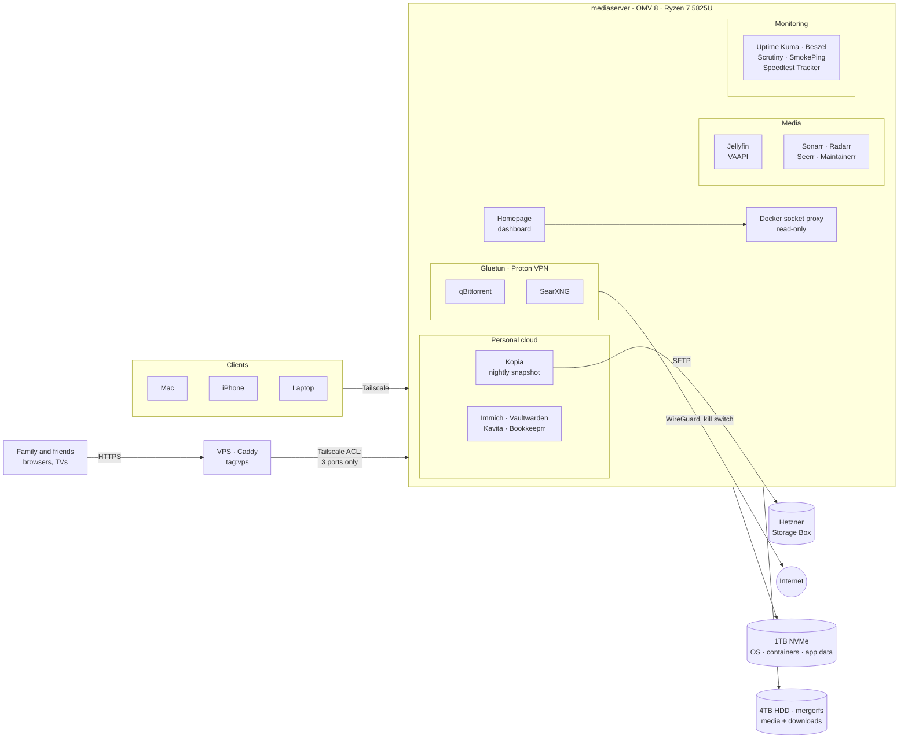

# Homelab

Self-hosted media server, monitoring stack and personal cloud, running on OpenMediaVault with Docker Compose. Everything is reachable privately over Tailscale. Only Jellyfin, Seerr and Immich are also published, through a small VPS reverse proxy that can reach nothing else on the network (see Networking and access).

## Architecture



## Hardware

| Component | Choice | Why |
|---|---|---|
| Server | AOOSTAR WTR Pro, AMD Ryzen 7 5825U | 8 Zen 3 cores for CPU-heavy work (subtitle rendering, photo indexing), 4 drive bays, 2× 2.5GbE |
| RAM | 16GB DDR4-3200 (1 of 2 slots) | Enough for the current stack; a second identical stick gives 32GB dual-channel |
| System disk | 1TB NVMe | OS, containers and all app data |
| Media disk | 4TB WD Red Plus (CMR) | Quiet 5400 rpm class, CMR for parity-friendly writes |
| OS | OpenMediaVault 8 (Debian 13) | Web-managed NAS OS with a Docker Compose plugin |

## Services

| Group | Service | Purpose | Port |
|---|---|---|---|
| Dashboard | Homepage | One page for everything; tiles come from Docker labels | 3000 |
| Media | Jellyfin | Streaming with VAAPI hardware transcoding; MyAnimeList sync via Ani-Sync | 8096 |
| Media | Sonarr / Radarr | Series and movie library management (renaming, organizing) | 8989 / 7878 |
| Media | Seerr | Browse and request titles; users log in with their Jellyfin accounts | 5055 |
| Media | Maintainerr | Rule-based library cleanup | 6246 |
| Downloads | qBittorrent | Download client, routed through Gluetun | 8080 |
| Photos | Immich | Photos and videos, phone upload; originals on the NVMe, ML off for now | 2283 |
| Passwords | Vaultwarden | Bitwarden-compatible password manager, Tailscale-only | 8222 (Tailscale Serve) |
| Books | Kavita | Manga and book reader | 5000 |
| Books | Bookkeeprr | Library manager and reader for manga and books | 8484 |
| Backup | Kopia | Encrypted off-site snapshots of `/appdata` to a Hetzner Storage Box | 51515 |
| Privacy | Gluetun | Proton VPN (WireGuard) with port forwarding and a kill switch | — |
| Privacy | SearXNG | Private meta search engine, routed through Gluetun | 8888 |
| Monitoring | Uptime Kuma | Service uptime checks | 3001 |
| Monitoring | Beszel | CPU, RAM, disk, temperatures and per-container usage | 8090 |
| Monitoring | Scrutiny | Drive health (SMART) with history | 8083 |
| Monitoring | SmokePing | Continuous latency to the router, ISP hops and public DNS | 8081 |
| Monitoring | Speedtest Tracker | Scheduled speed tests with history | 8082 |

## Storage

```
NVMe (/)
├── /compose        this repo: one folder per stack
├── /appdata        container config and data (backed up, not in Git)
└── /backup         backups and database dumps

HDD (/srv/mergerfs/data, mergerfs pool)
├── torrents/
│   ├── downloading/
│   └── completed/
└── media/
    ├── anime/  series/  movies/  youtube/
    └── books/  manga/  music/
```

- **Why mergerfs (+ SnapRAID later) instead of RAID5:** drives can be added one at a time and in mixed sizes, a failed drive only loses its own files, and idle drives can spin down. Parity will come from a dedicated 8TB SnapRAID drive.
- **One `/data` mount** for the download client and library managers, so finished downloads are moved or hardlinked instantly instead of copied.
- **Jellyfin mounts `media` read-only.** Metadata and artwork live in its own config folder.
- **Irreplaceable data** (photos, files, passwords) lives on the NVMe with off-site backups, not on the unprotected HDD.

## Networking and access

- **Tailscale** for all access: the server sits behind Odido 5G with **CGNAT**, so there are no open ports. Clients connect over WireGuard, directly where possible.
- **Exit node:** the server can act as a personal VPN on public Wi-Fi, opt-in per device.
- **Gluetun:** qBittorrent and SearXNG share Gluetun's network namespace, so all their traffic leaves through Proton VPN. If the VPN drops, they have no network at all (verified). `FIREWALL_OUTBOUND_SUBNETS` keeps replies to the LAN, Docker and Tailscale off the tunnel.
- **Public access through a VPS:** friends and family without Tailscale reach Jellyfin, Seerr and Immich through a small VPS running Caddy (automatic HTTPS). The VPS joins the tailnet as `tag:vps`, and the ACL lets it reach only the server on ports 8096, 5055 and 2283. The home server only makes outbound connections, so CGNAT is no problem. Vaultwarden, the admin UIs and everything else stay tailnet-only. On the public Immich name the admin paths are blocked, and fail2ban watches the Jellyfin and Immich logins.
- **Remote bitrate caps** in Jellyfin: 20 Mbps for the owner, 8 Mbps for family, 4 Mbps for everyone else, chosen from 14 days of speed-test history.
- **Fixed IP** through a DHCP reservation on the router rather than a static IP in the OS, so moving house only needs a new reservation.

## Security

- **Secrets never go in Git.** They live in each stack's `.env` file (ignored); `.env.example` files show which variables are needed.
- **gitleaks** runs as a pre-commit hook, and GitHub push protection is enabled.
- **Docker socket access goes through a read-only proxy** (`docker-socket-proxy`, `POST=0`). Direct socket access is effectively root on the host, even with `:ro`.
- **Least privilege:** containers run as a non-root user (`PUID=1000`, `PGID=100`) where possible; media is read-only for Jellyfin.
- **SSH** with keys only, on the server and the VPS.
- **Public exposure is limited to three services** behind the VPS, and the ACL stops the VPS from reaching anything else. No sign-ups on Immich or Vaultwarden, long generated passwords, TOTP on Vaultwarden.
- **Backups:** Kopia encrypts snapshots client-side before they leave for the Storage Box. SQLite apps are dumped nightly with `.backup`, and live database files are excluded so snapshots stay consistent. Restores of Vaultwarden and Immich have been tested.

## Incidents and lessons learned

**Secret in Git history.** A token was committed in an early version of a compose file. gitleaks caught it before the repo went public. The token was rotated first, then the history was rewritten, and a pre-commit hook plus push protection now block it from happening again.

**Tailscale control-plane stall.** After a network change on the 5G connection, the server kept its peer connections but its long-poll to Tailscale's coordination server timed out every two minutes. DNS, IPv4, MTU and IPv6 were ruled out step by step; restarting `tailscaled` fixed it. A systemd timer now restarts it automatically if the node stays offline for two consecutive checks.

**API incompatibility.** Jellyseerr failed to authenticate against Jellyfin 12 with HTTP 400 (not 401), which pointed to a request-format change rather than bad credentials. Replaced with its successor, Seerr.

**Browser transcoding.** Browsers transcode MKV, Opus/5.1 audio and styled subtitles. One file used HEVC 4:4:4 10-bit, which the iGPU can't decode, so it fell back to the CPU. Native clients (Jellyfin Media Player, Infuse) direct-play these instead.

## Backups

| Time | Job |
|---|---|
| 02:00 | Immich database dump |
| 02:20 | Bookkeeprr SQLite dump |
| 02:25 | Kavita SQLite dump |
| 02:30 | Vaultwarden SQLite dump |
| 03:00 | Kopia snapshot of `/appdata` to the Storage Box |

Regenerable data (Jellyfin cache and metadata, Immich thumbnails and encoded video, the Immich Postgres folder, live SQLite files) is excluded through `/appdata/.kopiaignore`. Parents' phone galleries are not backed up: they add only chosen photos to a shared Immich album.

## Conventions

- One folder per stack, managed by the OMV compose plugin; container data in `appdata` via `CHANGE_TO_COMPOSE_DATA_PATH`.
- Every service gets Homepage labels and an Uptime Kuma monitor.
- Containers in different stacks reach each other through the host IP, not container names.
- Pin versions of apps that hold data (Immich, Bookkeeprr) and update deliberately after reading the release notes.
- Stacks that share Gluetun are always restarted together (**Down → Up**), never Gluetun alone.

## Adding a new service

1. Create the compose file in OMV (Services → Compose → Files).
2. Put secrets in the env box, never in the YAML, and add a `.env.example`.
3. Add Homepage labels and an Uptime Kuma monitor.
4. Include its data in backups if it stores anything important.
5. `git pull --rebase` → `git status` (no `.env` files) → `git add .` → `git commit` → `git push`.

## Rebuilding from scratch

1. Install OpenMediaVault, omv-extras, and the compose, mergerfs and sharerootfs plugins.
2. Create the `compose`, `appdata` and `backup` shared folders on the NVMe, and the `data` mergerfs pool on the HDD.
3. Clone this repo into the compose folder.
4. Recreate each stack's `.env` from the password manager, using the `.env.example` files.
5. Restore `appdata` from backup, then bring each stack up.

## Roadmap

- SnapRAID parity drive (8TB) and a second RAM stick
- ~~Off-site backups (Kopia → Hetzner Storage Box) with tested restores~~ done
- ~~Immich and Vaultwarden~~ done; Nextcloud (files) still open
- Immich machine learning on the laptop GPU, after the family uploads
- Mail watcher that saves attachments and sends notifications (written, not deployed yet)
- Self-built network monitor with automatic latency-spike diagnosis
- Infrastructure as code: Ansible for the server, Terraform for the VPS reverse proxy
