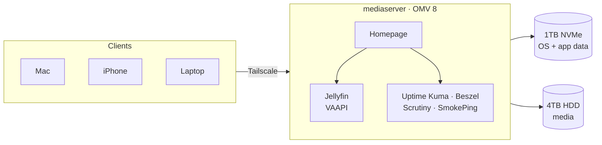

# Homelab

Self-hosted media server and personal cloud, running on OpenMediaVault with Docker Compose.

## Hardware
- **Server:** AOOSTAR WTR Pro (AMD Ryzen 7 5825U), 16GB DDR4
- **System disk:** 1TB NVMe (OS, containers, app data)
- **Media disk:** 4TB WD Red Plus (CMR)
- **OS:** OpenMediaVault 8 (Debian 13)
- **Remote access:** Tailscale

## Services
| Service | Purpose | Port |
|---|---|---|
| Homepage | Dashboard | 3000 |
| Jellyfin | Media streaming (VAAPI hardware transcoding) | 8096 |
| Sonarr | Series library management | 8989 |
| Uptime Kuma | Service uptime monitoring | 3001 |
| Beszel | Server health (CPU, RAM, temps, containers) | 8090 |
| Scrutiny | Drive health (SMART) | 8083 |
| SmokePing | Latency monitoring | 8081 |
| Speedtest Tracker | Scheduled speed tests | 8082 |

## Structure
Each service has its own folder, managed by the OMV compose plugin:
```
compose/
├── jellyfin/
├── network-monitoring/
├── homepage/
└── ...
```
- Container data lives in the `appdata` shared folder (on the NVMe), not in this repo.
- Media lives on the HDD.

## Conventions
- **Secrets never go in Git.** They live in each service's `.env` file, which is ignored via `.gitignore`.
- Containers run as a non-root user (`PUID=1000`, `PGID=100`) where possible.
- Every service gets Homepage labels, so it appears on the dashboard automatically.
- Docker socket access goes through a read-only socket proxy.

## Adding a new service
1. Create the compose file in OMV (Services → Compose → Files)
2. Put secrets in the env box, never in the YAML
3. Add Homepage labels
4. Add a monitor in Uptime Kuma
5. Include its data in backups, if it stores anything important
6. Commit: `git status` (check that no `.env` file is listed), `git add .`, `git commit`, `git push`

## Rebuilding from scratch
1. Install OpenMediaVault, omv-extras, and the compose, mergerfs and sharerootfs plugins
2. Create the `compose`, `appdata` and `backup` shared folders
3. Clone this repo into the compose folder
4. Recreate each service's `.env` from the password manager
5. Restore `appdata` from backup, then bring each stack up

## Architecture

